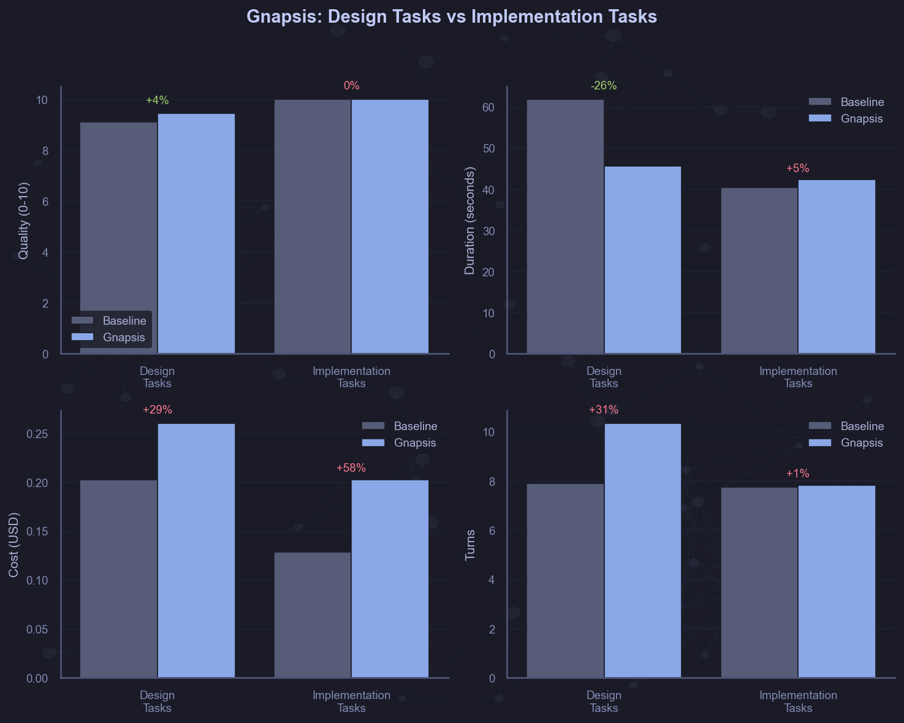
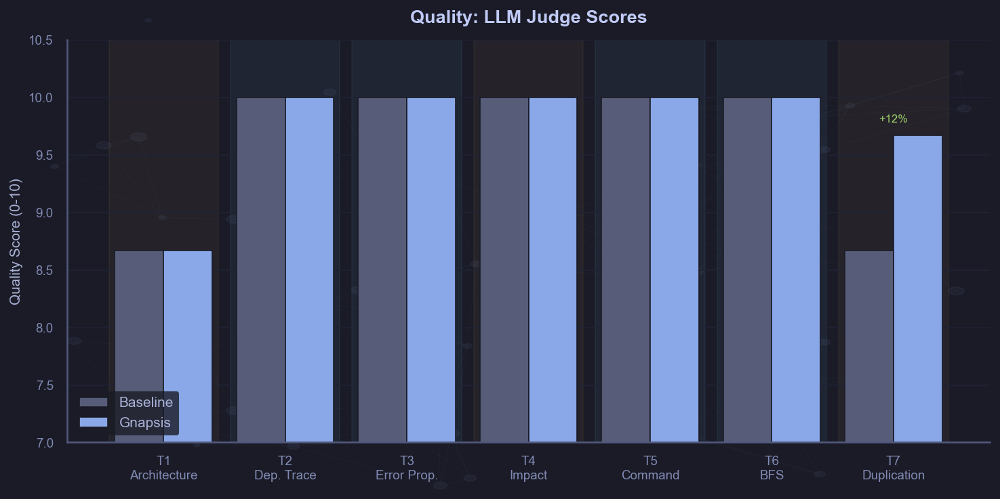
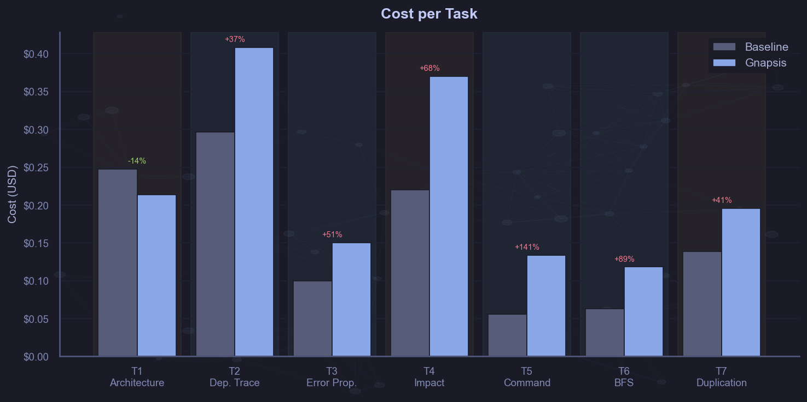
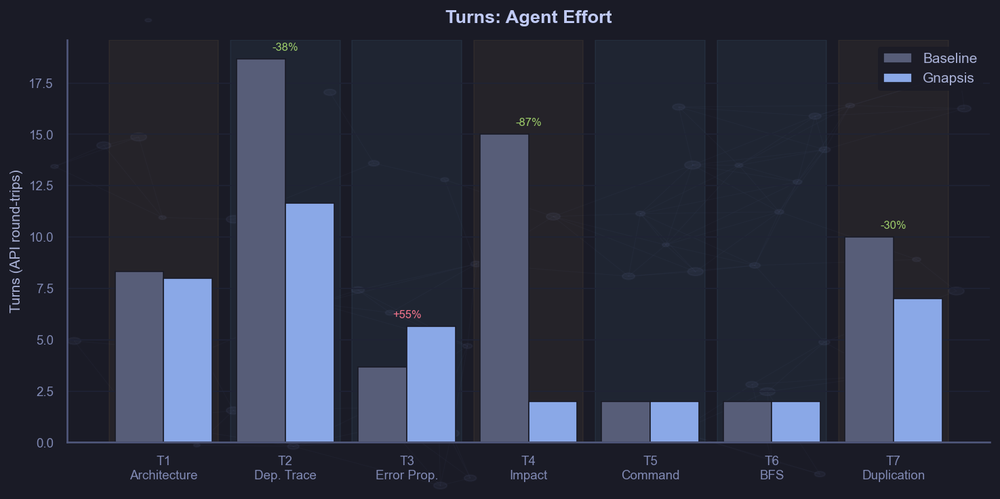
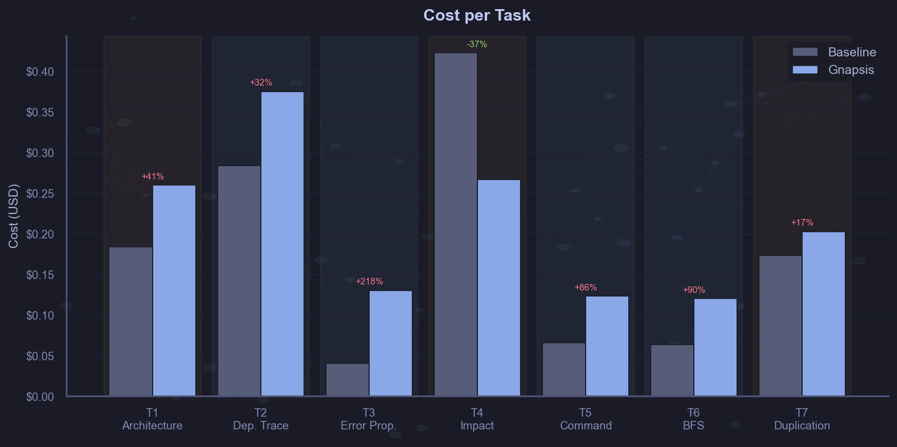
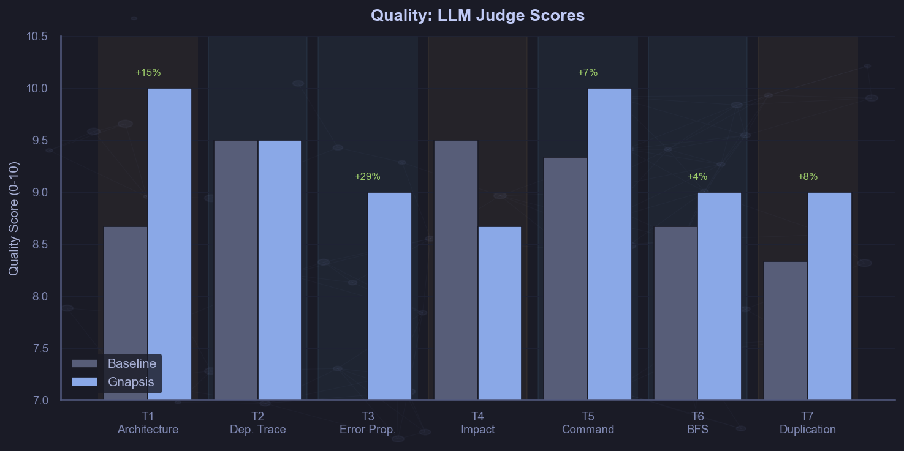
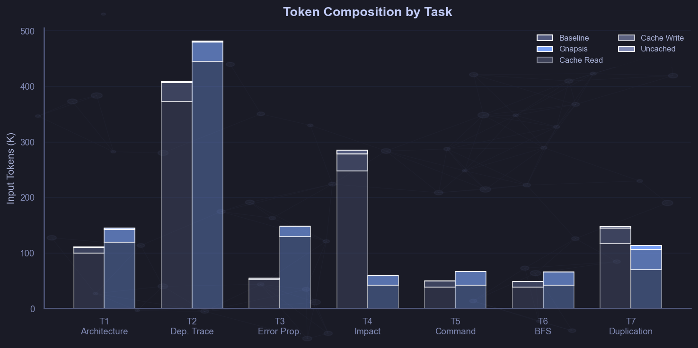
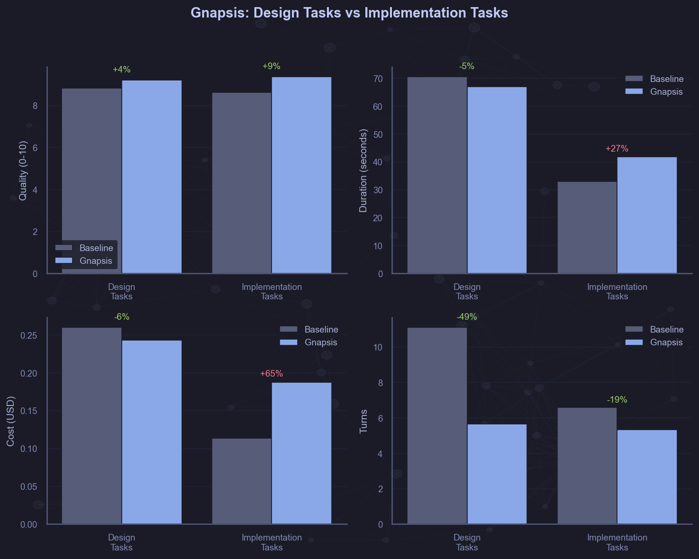

# Gnapsis Benchmark Report

A knowledge graph MCP server evaluated against Claude Code's built-in tools for code understanding tasks.

---

## Executive Summary

Gnapsis — a knowledge graph MCP server that maps codebase architecture through semantic entities and relationships — was benchmarked against Claude Code's native tools (Read, Grep, Glob, Bash) across 7 code understanding tasks.

The evaluation was conducted across four phases:

1. **Initial benchmark** (102 entities, 0 units): Promise was shown on design tasks, but quality was found to be nearly identical (9.6 vs 9.9/10). Most tasks hit the rubric ceiling.
2. **Prompt engineering** (v2 aggressive, v3 soft): Attempts to guide the model toward graph-first behavior resulted in degraded performance. Changes were reverted.
3. **Graph depth** (124 → 164 entities, 56 units added): Turn counts on complex tasks were dramatically reduced by adding method-level entities. T4 Impact Analysis was completed in 2 turns instead of 15.
4. **Rubric evolution** (binary → tiered): Rubrics were redesigned to distinguish "correct" from "comprehensive engineering analysis." The quality gap was nearly doubled from +0.33 to +0.60 points.

**Key finding**: Graph depth was found to matter more than prompt engineering. The graph was naturally used by the model when it contained the answers, and file reading was fallen back to when it didn't.

| Metric | Baseline | Gnapsis | Delta |
|--------|----------|---------|-------|
| Quality (tiered rubrics) | 8.71/10 | 9.31/10 | **+6.8%** |
| Turns (design tasks) | 11.1 | 5.7 | **-49%** |
| T4 Impact Analysis turns | 15 | 2 | **-87%** |
| T3 Error Propagation quality | 7.0 | 9.0 | **+29%** |
| Cost | $1.24 total | $1.48 total | +20% |
| Cost (projected with TOON) | $1.24 total | ~$0.98 total | **-21%** |

---

## Methodology

### Target Codebase

Gnapsis itself (~15K LoC, Rust) was used as the target. The codebase is organized as a layered architecture with MCP handlers, services, repositories, and a graph abstraction layer backed by PostgreSQL + Apache AGE. Dependency injection is achieved via derive macros, the Command Pattern is employed for batch operations, and a Best-First Search algorithm is implemented for semantic subgraph extraction.

### Task Design

Seven tasks were designed spanning architecture understanding, dependency tracing, error analysis, impact analysis, pattern recognition, algorithm understanding, and code quality review:

| ID | Task | Category | Difficulty |
|----|------|----------|------------|
| T1 | Architecture Layers | architecture | medium |
| T2 | Dependency Trace | dependency_tracing | hard |
| T3 | Error Propagation | error_analysis | medium |
| T4 | Impact Analysis | impact_analysis | hard |
| T5 | Command Pattern | pattern_recognition | medium |
| T6 | BFS Algorithm | algorithm_understanding | hard |
| T7 | Find Duplication | code_quality | hard |

Tasks were chosen to cover a range of code understanding activities, from single-file analysis (T5, T6) to cross-cutting architectural reasoning (T1, T4).

### Conditions

Each task was run under two conditions with identical system prompts:

- **Baseline**: Claude Code with built-in tools only (Read, Grep, Glob, Bash)
- **With Gnapsis**: Claude Code + gnapsis knowledge graph MCP server (18 tools, ~8K tokens of schema)

No gnapsis-specific guidance was added to the system prompt. When and whether to use graph tools was decided by the model itself.

### Model

Claude Sonnet (via Claude Code CLI) was used for all runs.

### Statistical Design

- 3 runs per task per condition = 42 runs per benchmark
- Metrics collected: quality score (LLM judge, 0-10), keyword hits, turns, duration, cost, token counts
- Quality was scored by a blind LLM judge against task-specific rubrics with expected concepts

---

## Phase 1: Initial Benchmark (0 Units)

**Graph state**: 102 entities (2 domains, 21 features, 26 namespaces, 53 components, 0 units)

High-level architecture was encoded in the graph — domains, features, namespaces, and component-level entities (structs, traits) — but no unit-level detail (methods, functions) was included.

### Results

| Task | Baseline Quality | Gnapsis Quality | Baseline Turns | Gnapsis Turns | Baseline Cost | Gnapsis Cost |
|------|-----------------|-----------------|----------------|---------------|---------------|--------------|
| T1 Architecture | 8.7 | **9.7** | 2.0 | 11.7 | $0.248 | $0.221 |
| T2 Dep. Trace | 10.0 | 10.0 | 18.3 | 18.3 | $0.297 | $0.408 |
| T3 Errors | 10.0 | 10.0 | 8.7 | 8.3 | $0.100 | $0.150 |
| T4 Impact | 10.0 | 10.0 | 15.0 | 9.3 | $0.220 | $0.335 |
| T5 Command | 10.0 | 10.0 | 2.0 | 2.7 | $0.055 | $0.134 |
| T6 BFS | 10.0 | 10.0 | 2.0 | 2.0 | $0.063 | $0.118 |
| T7 Duplication | 8.7 | **9.7** | 6.7 | 6.3 | $0.139 | $0.193 |

### Observations

1. **Promise was shown on design tasks**: T1 (+11% quality, -44% duration), T4 (-38% turns), and T7 (+11% quality) were found to benefit from the graph.
2. **No quality gain was observed on implementation tasks**: T2, T3, T5, T6 were all scored 10/10 under both conditions. Cost was added by the graph without answers being improved.
3. **A severe ceiling effect was identified**: 5 of 7 tasks were scored 10/10 in both conditions. "Correct" and "comprehensive" answers could not be distinguished by the binary rubrics.
4. **Significant cost overhead was incurred**: Design tasks +24%, implementation tasks +57%. The ~8K token schema represented a fixed cost per turn.

### The Design vs. Implementation Split

A clear pattern was revealed: tasks requiring understanding of relationships between components (architecture, impact analysis, duplication) were aided by gnapsis, while overhead was added for tasks solvable by reading 1-3 files (pattern recognition, algorithm analysis).

---

## Phase 2: Prompt Engineering

After the initial benchmark showed promise but high overhead, improvement of gnapsis utilization was attempted through system prompt modifications.

### v2: Aggressive Prompt

The following was added to the gnapsis condition:

> *"Use the gnapsis knowledge graph tools as your primary source. Only read source files directly when you need exact code that the graph doesn't provide."*

Results on selected tasks:

| Task | Metric | Before (v1) | After (v2) |
|------|--------|-------------|-------------|
| T1 | Turns | 11.7 | **6.3** |
| T1 | Quality | 9.7 | 8.7 |
| T4 | Turns | 9.3 | **18.0** |

T1 turns were improved but quality was degraded — file reads that were needed were skipped by the model. T4 was badly regressed — when forced to query the graph first, extra round-trips that would not otherwise have been made were generated.

### v3: Softer Prompt

The guidance was changed to:

> *"Start by using gnapsis knowledge graph tools to orient yourself, then read source files to fill in details."*

Only T4 was tested:

| Metric | v1 (no prompt) | v3 (soft) |
|--------|----------------|-----------|
| Turns | 9.3 | **20.7** |
| Cost | $0.335 | $0.353 |

Over-reliance on graph queries was caused even by softer guidance.

### Conclusion

**More harm than help was caused by prompt engineering.** Better judgment about when to use graph tools was exercised by the model on its own than when forced by any guidance. Unnecessary graph queries were made or necessary file reads were skipped under both the aggressive and soft prompts.

Identical system prompts for both conditions were reverted to, and no further prompt modifications were attempted.

---

## Phase 3: Graph Depth

### Hypothesis

If results could not be improved by prompt engineering, perhaps the graph itself needed to be deepened. No unit-level entities were present in the initial graph — structs and traits were known but not their methods and functions. When "what traits would I need to implement for a new backend?" was asked, files had to be read to find the methods, even with the graph available.

### Batch 1: 22 Units (graph traits + services)

11 units were added for the graph abstraction layer:
- CypherExecutor: `execute_cypher`, `run_cypher`
- SqlExecutor: `execute_sql`
- Transaction: `commit`, `rollback`
- GraphClient: `begin`
- Graph: `query`, `transaction`
- PostgresClient: `connect`, `build_age_query`, `parse_pg_row`

11 units were added for the service layer:
- EntityService: `create`, `update`
- GraphService: `unified_search`, `semantic_query`, `best_first_search`, `cosine_similarity`
- CommandService: `execute`, `execute_add`
- ValidationService: `find_orphan_entities`, `find_cycles`, `find_scope_violations`

**T4 Impact Analysis results (124 entities total)**:

| Metric | Baseline | Gnapsis v1 (0 units) | Gnapsis + 22 units |
|--------|----------|---------------------|-------------------|
| Turns | 15.0 | 9.3 | **2.0** |
| Cost | $0.220 | $0.335 | $0.275 |
| Quality | 9.7/10 | 10/10 | 10/10 |

**This was the breakthrough.** With method-level entities present in the graph, "what traits would you need to implement" could be answered directly from graph data in 2 turns instead of 15. The answer was contained in the graph; it just had to be queried.

### Batch 2: +40 Entities (repositories + MCP handlers)

6 components (repository structs) and 34 units across the full stack were added:
- EntityRepository (9 methods): create, find_by_id, update, delete, validate_belongs_to, classify, add_belongs, add_related, add_link
- QueryRepository (7 methods): get_entity_with_context, find_entities, get_document_entities, query_subgraph, search_entities_by_embedding, search_documents_by_embedding, get_entity_summaries_by_scope
- DocumentRepository (7 methods): upsert_document, create_code_reference, create_text_reference, attach_reference, get_stale_references, get_entity_references, delete_reference
- SchemaRepository (1 method): get_project_stats
- McpServer (10 handlers): resolve, search, query, analyze_document, project_overview, get_entity, find_entities, create_entity, update_entity, init_project

**Graph state for Benchmark 02**: 164 entities (2 domains, 21 features, 26 namespaces, 59 components, 56 units)

### Full Benchmark 02 Results (Old Rubrics)

With the expanded graph and original binary rubrics:

- Quality: Gnapsis 10.0/10 vs Baseline 9.7/10 (delta +0.30)
- Turns: -36% overall, design tasks -49%
- Cost: +20% overhead

Standout results:
- **T4 Impact Analysis**: 15 → 2 turns (-87%), $0.42 → $0.27 (-37%)
- **T2 Dependency Trace**: 18.7 → 11.7 turns (-38%)
- **T7 Find Duplication**: 10 → 7 turns (-30%)
- **T1 Architecture**: perfect gnapsis quality (10/10 all runs) vs baseline variability

But the ceiling effect persisted — most tasks were still scored 9-10 under both conditions with the old rubrics.

---

## Phase 4: Rubric Evolution

### The Ceiling Effect Problem

With binary rubrics, the judge's scoring criteria were structured as:

> *"Identifies the key traits... Lists some variants... Gets 3+ hops correct..."*

These bars were easily cleared by both conditions. A baseline answer that listed 4 layers with correct dependencies was scored 10/10. A gnapsis answer that identified 6 layers, named architectural patterns, discussed cross-cutting concerns, and evaluated trade-offs was also scored 10/10. Differentiation between them could not be made by the rubrics.

When T1 responses were compared qualitatively, the gap being missed by the rubrics was revealed:

**Typical baseline answer** (scored 10/10 with old rubrics):
- 4-5 layers were identified with module paths
- Dependency direction was listed
- Key technologies were named

**Typical gnapsis answer** (also scored 10/10 with old rubrics):
- 6 layers were identified with all specific components named
- Architectural patterns were named (Clean Architecture, Repository Pattern)
- The DI mechanism with derive macros was discussed
- Cross-cutting concerns were identified (error handling, configuration)
- SOLID principles in practice were noted

### Tiered Rubric Design

All 7 rubrics were redesigned with graduated scoring tiers:

| Score Range | Criteria Level |
|-------------|---------------|
| 4-5 | Structurally correct: main concepts are identified with file paths |
| 6-7 | Technically complete: all major components and key mechanisms are covered |
| 8 | Architectural awareness: patterns are named, abstractions identified, design style recognized |
| 9 | Engineering depth: cross-cutting concerns, SOLID principles, and fitness are evaluated |
| 10 | Comprehensive analysis: trade-offs, observability, standardization, alternatives, and improvements are assessed |

Awareness of engineering fundamentals was required by higher tiers:

| Dimension | What to look for |
|-----------|-----------------|
| Architectural Patterns | Named patterns (Clean Architecture, Repository, Command, Strategy, DI), SOLID principles |
| Error Handling | Error types, propagation strategy, boundary handling, recovery patterns |
| Observability | Logging, tracing, metrics, debug tooling |
| Standardization | Naming conventions, module organization, code style consistency |
| Configuration | Config layering, environment handling |
| Testing | Test patterns, coverage strategy, testability |

### Re-Scored Results

All 42 runs from Benchmark 02 were re-judged with the tiered rubrics (total re-judging cost: $0.69):

| Task | Baseline (tiered) | Gnapsis (tiered) | Delta | Delta % |
|------|-------------------|------------------|-------|---------|
| T1 Architecture | 8.67 | **10.00** | +1.33 | **+15%** |
| T2 Dep. Trace | 9.50 | 9.50 | 0.00 | 0% |
| T3 Error Prop. | 7.00 | **9.00** | +2.00 | **+29%** |
| T4 Impact | **9.50** | 8.67 | -0.83 | -9% |
| T5 Command | 9.33 | **10.00** | +0.67 | +7% |
| T6 BFS | 8.67 | **9.00** | +0.33 | +4% |
| T7 Duplication | 8.33 | **9.00** | +0.67 | +8% |
| **Mean** | **8.71** | **9.31** | **+0.60** | **+6.8%** |

The measured quality gap nearly doubled from +0.30 (old rubrics) to +0.60 (tiered rubrics). Differentiation that had been concealed by binary rubrics was revealed by the tiered scoring.

### Notable Results Under Tiered Rubrics

**T3 Error Propagation (+29%)**: The biggest quality gap was found here. AppError was identified and variants were listed by baseline answers (scored 7/10 — structurally correct). The error boundary pattern was additionally identified by gnapsis answers, error context for debugging was evaluated, and the Result<T, AppError> convention across layers was discussed (scored 9/10 — engineering depth).

**T1 Architecture (+15%)**: A consistent 10/10 was scored by gnapsis — comprehensive engineering analysis with named patterns, cross-cutting concerns, and trade-offs. An average of 8.67 was achieved by the baseline — architecturally aware but less comprehensive.

**T4 Impact Analysis (-9%)**: This was the one task where a higher score was achieved by the baseline under tiered rubrics. Despite 87% fewer turns being used, deeper "abstraction leak" analysis was sometimes missed by gnapsis answers — analysis that was discovered through the baseline's extensive file exploration. Insights about transaction semantics differences and backend parity issues were occasionally surfaced by the baseline's 15-turn exploration that the graph's clean abstraction did not prompt the model to consider.

**T5 Command Pattern (+7%)**: The task was solved in 2 turns by both conditions, but pattern fitness, related patterns (Builder, Undo/Redo), and comparisons to alternatives were more frequently discussed in gnapsis answers — pushing into the 9-10 tier.

---

## Analysis

### Quality: Where the Graph Helped Most

The largest quality improvements were observed on tasks that required:

1. **Cross-cutting analysis** (T3 +29%): Understanding how a concern (error handling) threads through multiple layers required the relationships between layers to be known. These relationships were encoded explicitly in the graph.

2. **Architectural reasoning** (T1 +15%): Architecture description required patterns, abstractions, and design principles to be identified. The graph's entity hierarchy (Domain → Feature → Namespace → Component → Unit) mapped directly to architectural layers.

3. **Code quality assessment** (T7 +8%): Finding duplication across files required knowledge of what exists where. An index of functions by location was provided by the graph's entity references.

The smallest (or negative) improvement was observed on:

4. **Tasks with extensive exploration** (T4 -9%): When the discovery of edge cases and trade-offs was rewarded, insights that would have been surfaced by 15 turns of file reading were missed by the graph's efficient 2-turn answer.

5. **Single-file tasks** (T2 0%, T6 +4%): When the answer resided in 1-3 files, no meaningful information was added by the graph.

### Efficiency: Fewer Turns, Focused Exploration

| Task Category | Baseline Turns | Gnapsis Turns | Reduction |
|---------------|---------------|---------------|-----------|
| Design tasks (T1, T4, T7) | 11.1 | 5.7 | **-49%** |
| Implementation tasks (T2, T3, T5, T6) | 6.6 | 5.3 | -19% |
| **Overall** | **8.5** | **5.5** | **-36%** |

The most dramatic reduction was observed in T4 Impact Analysis: from 15 turns to 2 (-87%). With unit-level entities for trait methods in the graph, a single query yielded the complete answer — no file exploration was needed.

### Consistency

Answer variance was reduced under the gnapsis condition. In Benchmark 02 with tiered rubrics, all three gnapsis T1 runs scored 10/10, while the baseline averaged 8.67 with run-to-run variation. In Benchmark 01, the baseline's weakest T1 run scored 7/10 — missing Apache AGE, the GraphClient trait, and the full DI picture — while gnapsis T1 averaged 9.7. A reliable floor of information appeared to be provided by the knowledge graph — concepts encoded as entities were not missed by the model, even on weaker runs.

### Cost

| Category | Baseline | Gnapsis | Delta |
|----------|----------|---------|-------|
| Design tasks (T1, T4, T7) | $0.260 | $0.243 | **-6%** |
| Implementation tasks (T2, T3, T5, T6) | $0.114 | $0.187 | +65% |
| **Total (7 tasks)** | **$1.236** | **$1.478** | **+20%** |

The cost picture split sharply by task type. On design tasks, gnapsis was 6% cheaper than baseline — the dramatic turn reduction on T4 ($0.423 → $0.267, -37%) more than offset the schema overhead on T1 and T7. On implementation tasks, the overhead was steep (+65%) because the ~8K token MCP schema was loaded on every turn without reducing turn count.

The overhead was driven by two sources:
1. **Fixed schema cost**: ~8K tokens were added per turn by the 18 MCP tool definitions
2. **Graph query cost**: Tokens were added when the graph was queried by the model

For simple tasks (T5, T6) that were completed in 2 turns regardless, the schema cost was pure overhead.

### TOON Cost Projection

TOON (Token-Oriented Object Notation) reduces MCP tool response sizes by an estimated ~40-60%. Since input tokens represented ~85% of total cost in this benchmark, a 40% TOON reduction would yield ~34% cost savings on gnapsis responses.

| Task | Baseline | Gnapsis (actual) | Gnapsis+TOON (est.) | vs Baseline |
|------|----------|------------------|---------------------|-------------|
| T1 Architecture | $0.184 | $0.260 | ~$0.172 | **-7%** |
| T2 Dep. Trace | $0.284 | $0.375 | ~$0.248 | **-13%** |
| T3 Error Prop. | $0.041 | $0.130 | ~$0.086 | +110% |
| T4 Impact | $0.423 | $0.267 | ~$0.176 | **-58%** |
| T5 Command | $0.066 | $0.123 | ~$0.081 | +23% |
| T6 BFS | $0.064 | $0.120 | ~$0.079 | +24% |
| T7 Duplication | $0.174 | $0.203 | ~$0.134 | **-23%** |
| **Total** | **$1.236** | **$1.478 (+20%)** | **~$0.976** | **-21%** |

With TOON, the overall cost would flip from +20% overhead to an estimated -21% savings. Design tasks would become significantly cheaper than baseline. A small overhead would remain on implementation tasks, driven primarily by the fixed schema cost.

---

## Progression Summary

How results were affected by each experimental phase is captured in the following table:

| Phase | Change | Quality Gap | T4 Turns | Cost Overhead |
|-------|--------|-------------|----------|---------------|
| Benchmark 01 | 102 entities, 0 units, binary rubrics | +0.28 (9.63→9.91) | 15→9.3 | +39% |
| Prompt v2 | Aggressive graph-first prompt | degraded | 9.3→18.0 | worse |
| Prompt v3 | Softer orient-then-read prompt | degraded | 9.3→20.7 | worse |
| +22 units | Graph traits + service methods | maintained | 15→**2.0** | +25% |
| +56 units (Bench 02) | Full stack methods, binary rubrics | +0.30 (9.7→10.0) | 15→**2.0** | +20% |
| Tiered rubrics | Graduated 4-10 scoring | **+0.60** (8.71→9.31) | — | — |

Key transitions:
- **Prompt engineering → graph depth**: The hypothesis that graph completeness matters more than usage guidance was motivated by the failed prompt experiments. This was confirmed by adding 22 units — T4 was reduced from 15 turns to 2 without any prompt changes.
- **Binary → tiered rubrics**: Real quality differences had been masked by the ceiling effect. The measured quality gap nearly doubled when tiered rubrics requiring architectural patterns, engineering fundamentals, and trade-off analysis were applied.

---

## Key Findings

### 1. Graph Depth > Prompt Engineering

Adding method-level entities to the knowledge graph was found to be dramatically more effective than any system prompt modification. The graph was naturally used by the model when it contained the answers, and file reading was fallen back to when it didn't. Unnecessary queries were caused, or necessary file reads were skipped, when graph usage was forced through prompts.

### 2. Value Concentrated on Complex, Cross-Cutting Tasks

The largest quality improvements were observed on tasks that required understanding relationships between components — architecture reviews, impact analysis, cross-cutting concern analysis. For simple single-file tasks, cost was added without benefit.

### 3. Rubric Design Determined What Was Measured

Ceiling effects were produced by binary rubrics that asked "was X mentioned?" Quality differences that had been concealed by binary scoring were revealed when tiered rubrics that graduate from "correct" to "comprehensive engineering analysis" were applied. What tool appeared better was directly affected by the choice of evaluation methodology.

### 4. Consistency as a Feature

A reliable information floor appeared to be provided by the graph. Concepts that were encoded as entities were not missed by the model across runs, reducing answer variance. This would matter in production use where predictability is valued.

### 5. The Human Role as Curation, Not Data Entry

The builder's understanding of the codebase was reflected by the graph. The quality of gnapsis answers was shaped by the quality of the ontology — which entities existed, how they were related, how deeply each area was modeled. The modeling effort was directed and the graph was maintained as the code evolved by the human; entities were not expected to be typed manually.

---

## Limitations

1. **Self-referential benchmark**: Gnapsis was benchmarked against its own codebase. A more complete ontology than what would typically be built may have been produced due to the graph builder's deep knowledge of the code.

2. **Small codebase**: At ~15K LoC, the entire codebase could be explored by the baseline in relatively few turns. The graph's advantage may increase on larger codebases where more turns and more file reads would be required by baseline exploration.

3. **Small n**: 3 runs per condition were used. High variance was shown by some tasks (T4 baseline stdev was large). Tighter confidence intervals would be produced by more runs.

4. **Single model**: All runs were performed with Claude Sonnet. Different results may be observed with other models or model versions.

5. **No TOON validation**: The TOON cost projections are estimates based on token reduction ratios, not measured from actual TOON-enabled runs.

---

## Next Steps

1. **Benchmark 03 with TOON enabled** should be run to validate cost projections
2. **n should be increased to 5-10 runs** for tighter statistical confidence
3. **A larger, unfamiliar codebase should be tested** to assess generalizability beyond self-referential benchmarking
4. **Graph construction ROI should be calculated**: time spent building the ontology vs. per-query savings
5. **Different models should be tested** (Opus, Haiku) to understand model sensitivity

---

## Appendix: Task Descriptions and Rubrics

### T1 — Architecture Layers
**Prompt**: Describe the layered architecture of the gnapsis codebase. What are the main layers, what module does each layer correspond to, and what is the direction of dependencies between layers?

**Tiered rubric**: 4-5: 3+ layers with correct direction are identified. 6-7: 4+ layers, DI mechanism, AGE backend are covered. 8: Components per layer are named, GraphClient trait is identified, architectural style is recognized. 9: Cross-cutting concerns, compile-time DI, SOLID, Repository Pattern are discussed. 10: 5+ layers, observability, standardization, and trade-offs are assessed.

### T2 — Dependency Trace
**Prompt**: Trace the complete data flow when the MCP tool 'search' is called. Starting from the handler, trace through every layer until embedding generation and database query execution.

**Tiered rubric**: 4-5: 3+ hops with paths are identified. 6-7: Complete MCP→GraphService→QueryRepository trace is provided. 8: Data transformations at boundaries and DI wiring are identified. 9: Error propagation, async patterns, and embedding injection are explained. 10: Failure modes, observability, and validation points are discussed.

### T3 — Error Propagation
**Prompt**: How does error handling work? What error type is defined by src/error.rs, what variants does it have, and how are errors converted for MCP protocol responses?

**Tiered rubric**: 4-5: AppError enum and thiserror are identified. 6-7: 6+ variants, From conversion, and 3+ mappings are listed. 8: The error boundary pattern (internal vs domain vs user-facing) is identified. 9: The strategy is evaluated against best practices — error context, Result convention. 10: Completeness is assessed — recovery strategies, observability support, RFC 7807 comparison.

### T4 — Impact Analysis
**Prompt**: If a new graph backend (SQLite instead of PostgreSQL) were to be added, what traits would need to be implemented, what files would need to change, and what would NOT need to change?

**Tiered rubric**: 4-5: Key traits are identified. 6-7: Full trait list, new module path, and unchanged layers are specified. 8: AppGraph type alias, DIP in practice, and Strategy Pattern are mentioned. 9: Config changes, migration implications, and testing strategy are discussed. 10: Backend parity issues, abstraction leaks, and overall quality are evaluated.

### T5 — Command Pattern
**Prompt**: A specific design pattern is implemented by src/services/commands.rs. The pattern should be identified, how it works should be explained, all command variants should be listed, and failure handling semantics should be described.

**Tiered rubric**: 4-5: The pattern is named, some variants are listed. 6-7: All 7 variants and stop-on-failure semantics are covered. 8: CommandResult structure and Rust ADTs vs OOP are explained. 9: Pattern fitness is evaluated, related patterns and transaction boundaries are identified. 10: Engineering quality, idempotency, observability, and alternatives are assessed.

### T6 — BFS Algorithm
**Prompt**: The Best-First Search algorithm implemented in src/services/graph.rs should be explained. Data structures, scoring, two strategies, and budget constraints should be covered.

**Tiered rubric**: 4-5: BinaryHeap and greedy traversal are identified. 6-7: Cosine similarity, both strategies, and 3 constraints are named. 8: The strategies are contrasted in detail, TOKENS_PER_CHAR is explained. 9: Caching, complexity, greedy implications, and cycle handling are analyzed. 10: Strategy trade-offs, improvements (beam search, A*), and testability are evaluated.

### T7 — Find Duplication
**Prompt**: Duplicated code should be found in src/repositories/. Functions or patterns implemented more than once across files should be identified.

**Tiered rubric**: 4-5: 2-3 duplications are identified. 6-7: 3-4 duplications are found with explanations. 8: 5+ duplications, DRY violation, and refactoring suggestions are provided. 9: Root cause is analyzed — architectural reasons and maintainability impact. 10: A refactoring plan with implementation details, trade-offs, divergence checks, and test coverage is provided.
